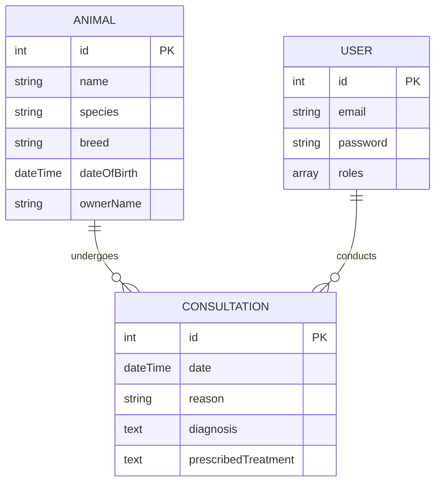

# Technical Notes — Vetocare

## 1. Contexte métier
* **Nom du projet :** Vetocare
* **Objectif :** Gestion des patients (animaux) et consultations pour une clinique vétérinaire.
* **Rôles utilisateurs définis :**
* `ROLE_VETO` : Lecture/Écriture/Modification des animaux et consultations.
* `ROLE_ADMIN` : Droits Veto + Droit exclusif de suppression (`DELETE`) et gestion des utilisateurs.

## 3. Modèle de données

## 4. Choix techniques
### Backend
#### Propriétaire de l'animal
Le propriétaire de l'animal est actuellement représenté par une simple chaîne de caractères. Dans le périmètre MVP, les propriétaires ne disposent pas de compte utilisateur et ne sont donc pas modélisés comme une entité. Une évolution ultérieure pourrait introduire une entité Owner dédiée si la gestion des propriétaires devient nécessaire.

#### Validation de la date de consultation
`Assert\Expression` est utilisé pour vérifier que la date d'une consultation est postérieure à la date de naissance de l'animal. Cette approche a été retenue plutôt qu'une contrainte de validation personnalisée, la règle étant simple et utilisée à un seul endroit.