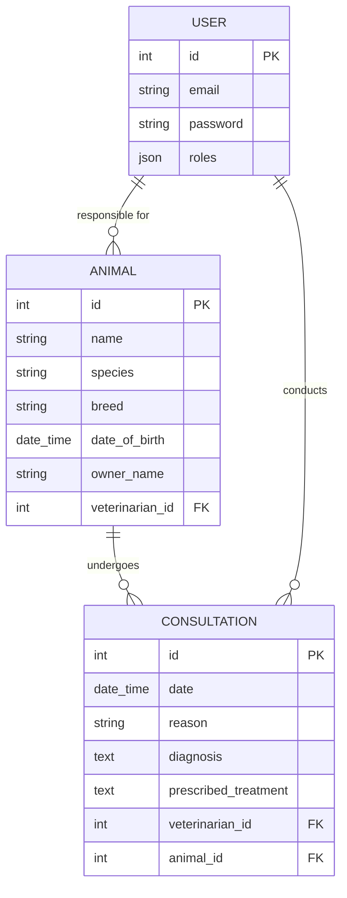

# Technical Notes — Vetocare

## 1. Contexte métier
**Nom du projet :** Vetocare

**Objectif :** Gestion des patients (animaux) et consultations pour une clinique vétérinaire.

**Rôles utilisateurs définis :**
* `ROLE_VETO` : Lecture/Écriture/Modification des animaux et consultations. Suppression des animaux selon les règles métier.
* `ROLE_ADMIN` : Droits Veto + Droit de suppression et gestion des utilisateurs.

**Règles  métiers :** 
* Les vétérinaires peuvent se remplacer et accéder aux dossiers des patients de la clinique.
* Lorsqu'un animal est créé, le vétérinaire connecté devient son vétérinaire responsable.
* Tous les vétérinaires peuvent consulter et modifier les animaux.
* Seul le vétérinaire responsable ou un administrateur peut supprimer un animal.
* Un animal ayant un historique de consultations ne peut pas être supprimé.
* Un utilisateur ayant des consultations associées ne peut pas être supprimé.

## 2. Modèle de données

## 3. Choix techniques
### Backend
#### Propriétaire de l'animal
Le propriétaire de l'animal est actuellement représenté par une simple chaîne de caractères. Dans le périmètre MVP, les propriétaires ne disposent pas de compte utilisateur et ne sont donc pas modélisés comme une entité. Une évolution ultérieure pourrait introduire une entité Owner dédiée si la gestion des propriétaires devient nécessaire.

#### Validation de la date de consultation
`Assert\Expression` est utilisé pour vérifier que la date d'une consultation est postérieure à la date de naissance de l'animal. Cette approche a été retenue plutôt qu'une contrainte de validation personnalisée, la règle étant simple et utilisée à un seul endroit.